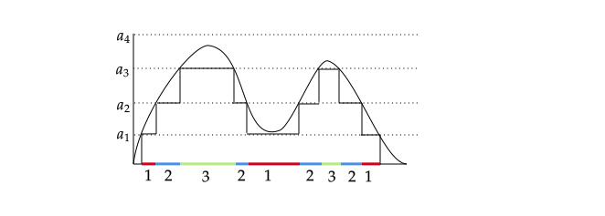
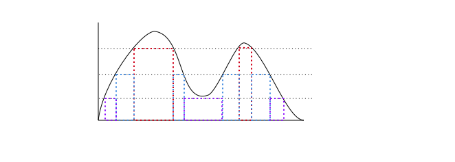

# Probability as a Measure
{: .no_toc }

## Table of contents
{: .no_toc .text-delta }

1. TOC
{:toc}

---

$\newcommand{\reals}{\mathbb{R}}$ $\newcommand{\nats}{\mathbb{N}}$ $\newcommand{\ind}{\mathbb{1}}$  $\newcommand{\pr}{\mathbb{P}}$ $\newcommand{\cv}[1]{\mathcal{#1}}$ $\newcommand{\nul}{\varnothing}$ $\newcommand{\eps}{\varepsilon}$ $\newcommand{\E}{\mathbb{E}}$ 

# Integration

Thus far, we have defined a random variable as a function. We have also developed a mechanism to help understand how to evaluate probability measures of limiting events and its relationship to continuity. Another important property of a random variable is its expectation or moment, and we can examine higher order moments for random variables which will provide more information about the behavior of the random variable. Moments also help us control certain aspects of the random variable, which allows us to make generalizations of sequences of random variables ad infinitum. Expectation is expressed as an integration. For random variable $X$, we define the expectation as

$$\E(X) = \int_\Omega X(\omega) d\pr = \int_\Omega X(\omega) \pr(d\omega)$$

Recall the discussion on induced measures from the measure theory and $\sigma$-algebra discussion. We can rewrite the integral by changing the variable of integration justified through induced measures by the random variable. $X : (\Omega, \cv{F}, \pr) \to (\reals, \cv{B})$ where $\lambda$ is the induced measure on $(\reals, \cv{B})$:

$$\E(X) = \int_\Omega X(\omega) \pr(d\omega) = \int_\reals x \lambda(dx)$$

## Riemann-Darboux Function Approximation is not Sufficient, a Proposed Solution

At this point, integration ought to be defined. In the Riemann sense, integration is not entirely well defined as we see pitfalls when Riemann integrating some pathological functions. This is particularly troublesome because it means Riemann integration is not a general enough technique. For example, let $f(\omega) = \ind_{\omega \in \mathbb{Q}}$. where $\omega \in (0,1)$. It is easy to show the lower and upper Riemann sums do not agree, thus the Riemann integral is not defined. 

**Exercise**: Show that the function above is not Riemann integrable. (Hint: Riemann integration requires the lower and upper sum to agree in the limit in order to be integrable, in the Riemann sense.)

The integral of the non-Riemann integrable function given above is one formulation of asking the question "what is the probability of picking a rational number from all real numbers in the interval [0,1]?" Since the rational numbers are countable, the probability should be 0. Yet, breaking a function up into interval partitions and observing how its upper and lower sum converges in the Riemann sense will not provide an adequate answer (the function is not Riemann integrable). So the Riemann integral is sufficient for a subset of "nice" functions, but there are functions in which the Riemann integral is not adequate. Thus we need another approach to integration - one even more general to handle more than just the "nice" functions. As Riemann integration relied on forming peicewise functions that approximate the original function from above and below based on interval partions, we would need to estiblish another paradigm of approximating a function. Hopefully this new paradigm will help form a more general definition of an integral.

### Simple non-Negative Functions

We introduce the idea of a simple function in hopes of approximating general function. A **simple function** is a non-negative measurable function that can be expressed as a finite linear combination of indicator functions on disjoint sets. That is for simple $f: (\Omega, \cv{F}) \to ([0,\infty], \cv{B}([0,\infty]))$:

$$f(\omega) := \sum_{i=1}^N a_{i} \ind_{A_{i}}(\omega)$$

where $a\_i \geq 0$ is a sequence of constants and $A\_i$ is a sequence of disjoint sets indexed by $i$. While this may look like we are approximating the function in a Riemann sense where we take $\inf f(x) \Delta x$ or $\sup f(x) \Delta x$, however the difference is that $A\_i$ does not need to be an interval; it could be a union of seperate disjoint intervals. It could even be a single point. The sole requirement is that $A\_i$ must be $\cv{F}$-measurable.  

### General non-Negative Functions

The simple function is peicewise by definition. However it can be used to approximate more general non-negative measurable functions. Specifically, for non-negative general function $f$, it can be approximated from below by a sequence of simple functions $f\_n$ with arbitrary precision. This is called the **simple function approximation theorem**.

_Proof_ : Given a function $f$, we form a simple function $f\_n$ by dividing is co-domain into $2^n +1$ intervals of equal length, so that each interval is of length $1/2^n$. Define the interval $I\_{n,k} = [\frac{k-1}{2^n}, \frac{k}{2^n})$ for $k=1,...,2^{2^n}$. For $k=2^{2^n}+1$ let the interval $I_{n,k} = [2^n, \infty)$. Now define $A_{n,k} = f^{-1}(I_{n,k})$ - the preimage of $f$ on these intervals. Each $A_{n,k}$ is measurable for each $k$ for any $n$ since $f$ is measurable. 

Now we define $f\_n$ as:

$$f_n(\omega) = \sum_{i=1}^{2^{2^n}+1} \frac{i-1}{2^n} \ind_{A_{n,i}})(\omega)$$

For any $\omega$, $f(\omega) - f\_n(\omega) < 1/2^n$ by construction of $f\_n$. So when $n$ is large enough, $f\_n \to f$ pointwise with arbitrary precision. If $f$ is bounded, this convergence is uniform almost everywhere since after a large enough $n$, $f^{-1}(I_{n,2^{2^n+1}}) = \nul$ which has measure 0.  $\tag*{∎}$ 

We did not need to divide this using powers of 2. We could have divided into powers of 100 and the idea of the proof would remain the same. A picture of a function $f$ overlayed with a simple function will better help understand this concept.

We can represent this simple function as

$$f_n(\omega) = a_1\ind_{A_1} + a_2\ind_{A_2} + a_3\ind_{A_3}$$

Here, we divided the the co-domain at values $a\_1$ to $a\_4$ and the regions in red in the domain is the measurable set $A\_1$, regions in blue is the measurable set $A\_2$ and the regions in green is the measurable set $A\_3$. $f\_{n+1}$ is formed by further subdividing these regions in the codomain to smaller regions, and the number of regions increases, which in turn produces better approximations of $f$. So by construction $0 \leq f\_n \leq f\_{n+1}$ where $f\_n \uparrow f$. 

### General Functions

So far we have been dealing with non-negative functions. Now, we can consider functions that may also be negative. A function $f$ may have portions of its codomain where it is negative and portions where it is positive. If we define $f^+$ and $f^-$ as the following:

$$f^+(\omega) = \max(f(\omega), 0)\;\qquad \; f^-(\omega) = -\min(f(\omega), 0)$$

then $f^+$ corresponds to $f$ where $f$ is positive or zero, and $f^-$ corresponds to $f$ where $f$ is negative or zero. Furthermore,

$$f = f^+-f^-\; \qquad \; |f| = f^+ + f^-$$

$f^+$ and $f^-$ are both non-negative functions, and thus both can be represented as the limits of sequences of simple functions $\geq 0$.

With measurable functions now defined in terms of a sequence of $f\_n$, we are now ready to talk about the Lebesgue integral.

## Lebesgue Integral

The Riemann integral attempts to partition the region of integration into infinitessimal intervals. The Lebesgue integral also partitions the region of integration, but the partitions need not be single intervals, and it need not be sums of infinitessimal partitions. A picture provides how the Lebesuge integral is evaluated.

The above image is the case when $n=3$, where $f\_n$ is approximated by partitioning the codomain into 3 equally spaced intervals at $f = a\_1$, $f=a\_2$, and $f=a\_3$. Then we examine the measure of $\\{\omega : f(\omega) = a\_1 \\}$ and multiply it by $a\_1$ and we do the same for $a\_2$ and $a\_3$.

So, if the function $f: (\Omega, \cv{F}, \mu) \to (\reals^+, \cv{B})$ is a simple function, then we can write the function as:

$$f = \sum_{i=1}^N a_i \ind_{A_i}$$

The integral over some measurable set $E \in \cv{F}$ is thus defined as:

$$\int_E f \,d\mu = \int_E \sum_{i=1}^N a_i \ind_{A_i} \,d\mu = \sum_{i=1}^N a_i \int_E \ind_{A_i} \,d\mu = \sum_{i=1}^N a_i \mu(A_i)$$

So the integral is the measure of the preimages $A_i \in\cv{F}$, multiplied by the value of the step function value $a_i$, then summed over all $i$. We now can develop a couple properties about integrals of simple functions. The following properties assumes a region of integration with measure $>0$.

### Additivity

For simple $f, g$, $\int f+g \,d\mu = \int f \,d\mu + \int g \,d\mu$.

_Proof_ : Let $f = \sum\_{i=1}^N a\_i \ind\_{A\_i}$ and $g = \sum\_{k=1}^M b\_k \ind\_{B\_k}$ and $f+g = \sum\_{i=1}^N \sum\_{k=1}^M (a\_i + b\_k) \ind\_{A\_i \cap B\_k}$. So we can rewrite each integral as:

$$\int f\,d\mu = \sum_{k=1}^M \sum_{i=1}^N a_i \mu(A_i \cap B_k)\; \qquad \; \int g \,d\mu= \sum_{k=1}^M \sum_{i=1}^N b_k \mu(A_i \cap B_k)$$

Thus they are compatible to add:

$$\int f \,d\mu +  \int g \,d\mu = \sum_{k=1}^M \sum_{i=1}^N (a_i + b_k) \mu(A_i \cap B_k) = \int f+g \,d\mu$$

It is easy to see how the integral is closed under scalar multiplication as well, thus also proves linearity of the integral. $\tag*{∎}$ 

### Monotonicity

If $0 \leq f \leq g$ are simple, then $\int f \,d\mu \leq \int g \,d\mu$. 

_Proof_ : First we note that if $f \geq 0$ then $\int f \,d\mu \geq 0$ which is immediately true from the definition of simply function integration. Now if $f \leq g$ then $g-f \geq 0$ so $\int g -f \,d\mu \geq 0$. Then by additivity $\int g \,d\mu \geq \int f \,d\mu$. $\tag*{∎}$

### For General non-Negative Functions

Since $f\_n \uparrow f$, then we can define the integral of a general $f \geq 0$ as 

$$\sup\left\lbrace \int s \,d\mu : \text{simple }s \leq f\right\rbrace$$ 

That is, the supremum of the integral of simple $s$ where $s \leq f$.

### Monotone Convergence

This is a critical result. If $0\leq f\_n \uparrow f$ for $f\_n$ and $f$ both $(\Omega, \cv{F}) \to (\reals^+, \cv{B})$, then $\lim \int f\_n \,d\mu = \int \lim f\_n \,d\mu = \int f \,d\mu$. Ultimately the proof relies on the monotonicity of measures.

_Proof_ : We already have that $f\_n \uparrow f$ so $\lim \int f\_n \,d\mu \leq \int f \,d\mu$. It suffices to show $\lim \int f\_n \,d\mu \geq \int f \,d\mu$. We define another simple function $h$ that is $0\leq h \leq f$. Furthermore, we take $\alpha \in (0,1)$, and define Borel sets in the domain as 

$$A_n = \{\omega \in \Omega : f_n (\omega) > \alpha h(\omega)\}$$

$A\_n \subseteq A\_{n+1}$ by the construction of the set above, and $\cup\_n A\_n = \Omega$. By continuity of measures, $\mu(\Omega) = \mu(\cup\_n A\_n) = \lim\_n \mu(A\_n)$. Now, 

$$\alpha \int_{A_n} h \,d\mu \leq \int_\Omega f_n \,d\mu$$

We can write the last two expressions with limits as:

$$\alpha \lim_{n\to\infty} \sum_{i=1}^N h \mu(A_{n,i}) = \alpha \sum_{i=1}^N h \mu(\Omega_i) \leq \lim_{n\to\infty} \int f_n \,d\mu$$

There is abuse of notation above. $A\_{n,i}$ is a partition of $A\_n$ and $\Omega\_i$ is a partition of the whole space $\Omega$. The limit is passed through the sum and we invoke continuity of measures.

Taking the supremum on both sides, $\sup \sum_{i=1}^N h \mu(\Omega_i) = \int f \,d\mu$ by definition as $0 \leq h \leq f$. We may drop the $\alpha$ as $\alpha \in (0,1)$. Thus: 

$$\int f \,d\mu \leq \lim_{n\to\infty} \int f_n \,d\mu$$ 

Therefore, $\int f \,d\mu = \lim_{n\to\infty} \int f_n \,d\mu$. $\tag*{∎}$ 